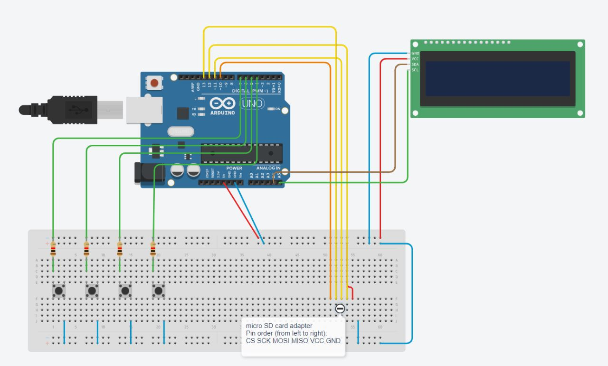

# game-station

## What's this?

Mini console to play charades and spy, coded in Arduino, C, and C++.

The game station project came to light when me and my friends noticed apps for playing the spy game or charades aren't as good as we expected them to be.
That's why I decided to code my own mini console which would be a hundred times better than those apps. I don't know if it's that good, but I came up with a
pretty decent result.

## Circuit

The circuit looks like this

This is what you need: a couple of resistors, an I2c LCD display, four buttons and a micro SD card with its micro SD card reader module.
For the code to work its important that you copy the "unrepeated-nouns.txt" and "unrepeated-verbs.txt" to the SD and rename them as
"nouns.txt" and "verbs.txt" respectively.

PD: I'm so sorry about the libraries being in the same directory as the sketch, but I couldn't manage the arduino vscode extension to reach them if they were in their own libraries directory.

## Improvements

I'd like to say that the software of this project is already cooked up, but obviously bugs will arise. The next step is designing and making a box to put the console into it, and make it look like a nintendo from the 2000's. Media will be uploaded when finished.

### Credits

Thanks to Joaquin "Farmen" Garmendia for helping me with this project, mainly with the word filtering code.
Thanks to Juan Pablo "Maffia" Maffei for giving me an important hand in the box designing and manufacturing (we're working on it).
